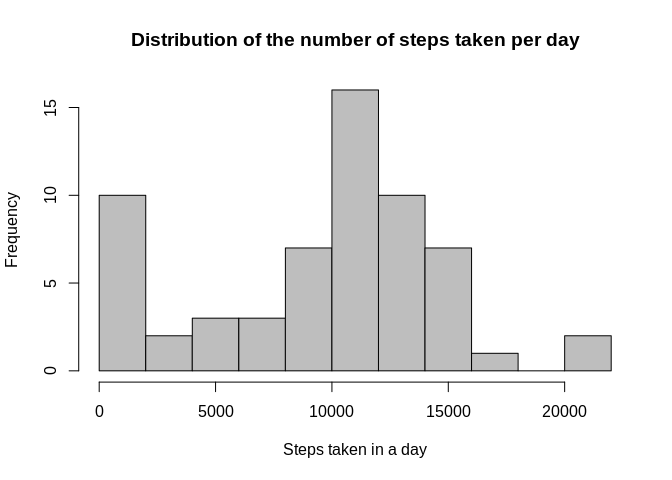
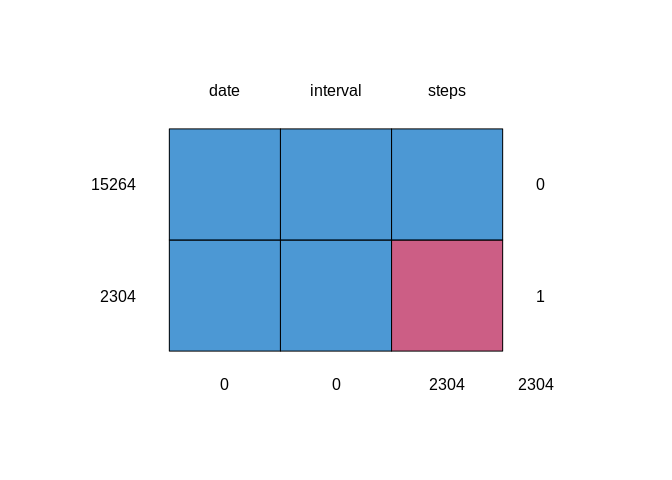
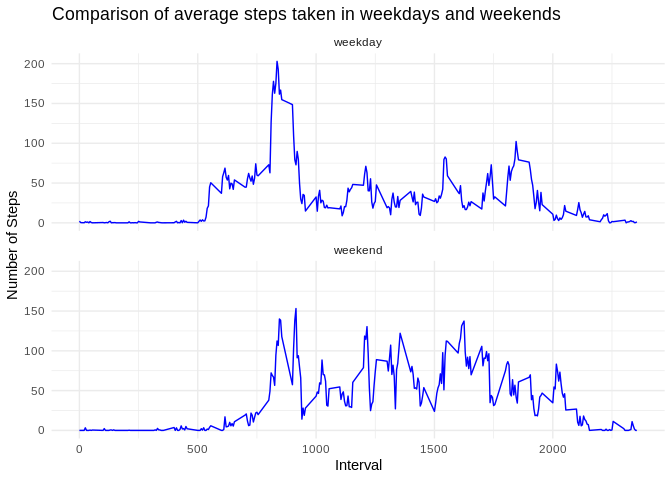

Introduction
------------

It is now possible to collect a large amount of data about personal
movement using activity monitoring devices such as a Fitbit, Nike
Fuelband, or Jawbone Up. These type of devices are part of the
“quantified self” movement – a group of enthusiasts who take
measurements about themselves regularly to improve their health, to find
patterns in their behavior, or because they are tech geeks. But these
data remain under-utilized both because the raw data are hard to obtain
and there is a lack of statistical methods and software for processing
and interpreting the data.

This assignment makes use of data from a personal activity monitoring
device. This device collects data at 5 minute intervals through out the
day. The data consists of two months of data from an anonymous
individual collected during the months of October and November, 2012 and
include the number of steps taken in 5 minute intervals each day.

Loading and preprocessing the data
----------------------------------

    url <- "https://d396qusza40orc.cloudfront.net/repdata%2Fdata%2Factivity.zip"
    download.file(url, destfile = "project1_data.zip")
    unzip("project1_data.zip")
    activity <- read.csv("activity.csv")

What is mean total number of steps taken per day?
-------------------------------------------------

**Calculate the total number of steps taken per day**

    library(dplyr)
    total_steps <- activity %>% 
      group_by(date) %>% 
      summarise(total = sum(steps, na.rm = TRUE))
    knitr::kable(total_steps, 
                 caption = "Total number of steps taken per day",
                 align = "l")

<table>
<caption>Total number of steps taken per day</caption>
<thead>
<tr class="header">
<th style="text-align: left;">date</th>
<th style="text-align: left;">total</th>
</tr>
</thead>
<tbody>
<tr class="odd">
<td style="text-align: left;">2012-10-01</td>
<td style="text-align: left;">0</td>
</tr>
<tr class="even">
<td style="text-align: left;">2012-10-02</td>
<td style="text-align: left;">126</td>
</tr>
<tr class="odd">
<td style="text-align: left;">2012-10-03</td>
<td style="text-align: left;">11352</td>
</tr>
<tr class="even">
<td style="text-align: left;">2012-10-04</td>
<td style="text-align: left;">12116</td>
</tr>
<tr class="odd">
<td style="text-align: left;">2012-10-05</td>
<td style="text-align: left;">13294</td>
</tr>
<tr class="even">
<td style="text-align: left;">2012-10-06</td>
<td style="text-align: left;">15420</td>
</tr>
<tr class="odd">
<td style="text-align: left;">2012-10-07</td>
<td style="text-align: left;">11015</td>
</tr>
<tr class="even">
<td style="text-align: left;">2012-10-08</td>
<td style="text-align: left;">0</td>
</tr>
<tr class="odd">
<td style="text-align: left;">2012-10-09</td>
<td style="text-align: left;">12811</td>
</tr>
<tr class="even">
<td style="text-align: left;">2012-10-10</td>
<td style="text-align: left;">9900</td>
</tr>
<tr class="odd">
<td style="text-align: left;">2012-10-11</td>
<td style="text-align: left;">10304</td>
</tr>
<tr class="even">
<td style="text-align: left;">2012-10-12</td>
<td style="text-align: left;">17382</td>
</tr>
<tr class="odd">
<td style="text-align: left;">2012-10-13</td>
<td style="text-align: left;">12426</td>
</tr>
<tr class="even">
<td style="text-align: left;">2012-10-14</td>
<td style="text-align: left;">15098</td>
</tr>
<tr class="odd">
<td style="text-align: left;">2012-10-15</td>
<td style="text-align: left;">10139</td>
</tr>
<tr class="even">
<td style="text-align: left;">2012-10-16</td>
<td style="text-align: left;">15084</td>
</tr>
<tr class="odd">
<td style="text-align: left;">2012-10-17</td>
<td style="text-align: left;">13452</td>
</tr>
<tr class="even">
<td style="text-align: left;">2012-10-18</td>
<td style="text-align: left;">10056</td>
</tr>
<tr class="odd">
<td style="text-align: left;">2012-10-19</td>
<td style="text-align: left;">11829</td>
</tr>
<tr class="even">
<td style="text-align: left;">2012-10-20</td>
<td style="text-align: left;">10395</td>
</tr>
<tr class="odd">
<td style="text-align: left;">2012-10-21</td>
<td style="text-align: left;">8821</td>
</tr>
<tr class="even">
<td style="text-align: left;">2012-10-22</td>
<td style="text-align: left;">13460</td>
</tr>
<tr class="odd">
<td style="text-align: left;">2012-10-23</td>
<td style="text-align: left;">8918</td>
</tr>
<tr class="even">
<td style="text-align: left;">2012-10-24</td>
<td style="text-align: left;">8355</td>
</tr>
<tr class="odd">
<td style="text-align: left;">2012-10-25</td>
<td style="text-align: left;">2492</td>
</tr>
<tr class="even">
<td style="text-align: left;">2012-10-26</td>
<td style="text-align: left;">6778</td>
</tr>
<tr class="odd">
<td style="text-align: left;">2012-10-27</td>
<td style="text-align: left;">10119</td>
</tr>
<tr class="even">
<td style="text-align: left;">2012-10-28</td>
<td style="text-align: left;">11458</td>
</tr>
<tr class="odd">
<td style="text-align: left;">2012-10-29</td>
<td style="text-align: left;">5018</td>
</tr>
<tr class="even">
<td style="text-align: left;">2012-10-30</td>
<td style="text-align: left;">9819</td>
</tr>
<tr class="odd">
<td style="text-align: left;">2012-10-31</td>
<td style="text-align: left;">15414</td>
</tr>
<tr class="even">
<td style="text-align: left;">2012-11-01</td>
<td style="text-align: left;">0</td>
</tr>
<tr class="odd">
<td style="text-align: left;">2012-11-02</td>
<td style="text-align: left;">10600</td>
</tr>
<tr class="even">
<td style="text-align: left;">2012-11-03</td>
<td style="text-align: left;">10571</td>
</tr>
<tr class="odd">
<td style="text-align: left;">2012-11-04</td>
<td style="text-align: left;">0</td>
</tr>
<tr class="even">
<td style="text-align: left;">2012-11-05</td>
<td style="text-align: left;">10439</td>
</tr>
<tr class="odd">
<td style="text-align: left;">2012-11-06</td>
<td style="text-align: left;">8334</td>
</tr>
<tr class="even">
<td style="text-align: left;">2012-11-07</td>
<td style="text-align: left;">12883</td>
</tr>
<tr class="odd">
<td style="text-align: left;">2012-11-08</td>
<td style="text-align: left;">3219</td>
</tr>
<tr class="even">
<td style="text-align: left;">2012-11-09</td>
<td style="text-align: left;">0</td>
</tr>
<tr class="odd">
<td style="text-align: left;">2012-11-10</td>
<td style="text-align: left;">0</td>
</tr>
<tr class="even">
<td style="text-align: left;">2012-11-11</td>
<td style="text-align: left;">12608</td>
</tr>
<tr class="odd">
<td style="text-align: left;">2012-11-12</td>
<td style="text-align: left;">10765</td>
</tr>
<tr class="even">
<td style="text-align: left;">2012-11-13</td>
<td style="text-align: left;">7336</td>
</tr>
<tr class="odd">
<td style="text-align: left;">2012-11-14</td>
<td style="text-align: left;">0</td>
</tr>
<tr class="even">
<td style="text-align: left;">2012-11-15</td>
<td style="text-align: left;">41</td>
</tr>
<tr class="odd">
<td style="text-align: left;">2012-11-16</td>
<td style="text-align: left;">5441</td>
</tr>
<tr class="even">
<td style="text-align: left;">2012-11-17</td>
<td style="text-align: left;">14339</td>
</tr>
<tr class="odd">
<td style="text-align: left;">2012-11-18</td>
<td style="text-align: left;">15110</td>
</tr>
<tr class="even">
<td style="text-align: left;">2012-11-19</td>
<td style="text-align: left;">8841</td>
</tr>
<tr class="odd">
<td style="text-align: left;">2012-11-20</td>
<td style="text-align: left;">4472</td>
</tr>
<tr class="even">
<td style="text-align: left;">2012-11-21</td>
<td style="text-align: left;">12787</td>
</tr>
<tr class="odd">
<td style="text-align: left;">2012-11-22</td>
<td style="text-align: left;">20427</td>
</tr>
<tr class="even">
<td style="text-align: left;">2012-11-23</td>
<td style="text-align: left;">21194</td>
</tr>
<tr class="odd">
<td style="text-align: left;">2012-11-24</td>
<td style="text-align: left;">14478</td>
</tr>
<tr class="even">
<td style="text-align: left;">2012-11-25</td>
<td style="text-align: left;">11834</td>
</tr>
<tr class="odd">
<td style="text-align: left;">2012-11-26</td>
<td style="text-align: left;">11162</td>
</tr>
<tr class="even">
<td style="text-align: left;">2012-11-27</td>
<td style="text-align: left;">13646</td>
</tr>
<tr class="odd">
<td style="text-align: left;">2012-11-28</td>
<td style="text-align: left;">10183</td>
</tr>
<tr class="even">
<td style="text-align: left;">2012-11-29</td>
<td style="text-align: left;">7047</td>
</tr>
<tr class="odd">
<td style="text-align: left;">2012-11-30</td>
<td style="text-align: left;">0</td>
</tr>
</tbody>
</table>

**Make a histogram of the total number of steps taken each day**

    hist(total_steps$total, 
         main = "Distribution of the number of steps taken per day",
         xlab = "Steps taken in a day",
         col = "grey",
         breaks = 8)

**Calculate and report the mean and median of the total number of steps
taken per day**

    mean(total_steps$total) #mean

    ## [1] 9354.23

    median(total_steps$total) #median

    ## [1] 10395

The mean and median total number of steps taken per day are 9354.2295082
and 10395, respectively.

What is the average daily activity pattern?
-------------------------------------------

**Make a time series plot of the 5-minute interval (x-axis) and the
average number of steps taken, averaged across all days (y-axis)**

    total_interval <- activity %>% 
      group_by(interval) %>% 
      summarise(total = mean(steps, na.rm = TRUE))
    library(ggplot2)
    ggplot(total_interval, aes(interval, total)) +
             geom_line(color="blue") +
         labs(title = "Average daily activity pattern", 
         x = "Time interval (0000=midnight, 1200=noon, etc)", 
         y = "Average total number of steps") +
      theme_minimal()

**Which 5-minute interval, on average across all the days in the
dataset, contains the maximum number of steps?**

    max_interval <- total_interval %>% 
      filter(total == max(total_interval$total))
    max_interval[1,1] #5min interval with maximum number of steps

    ## # A tibble: 1 x 1
    ##   interval
    ##      <int>
    ## 1      835

On average, the 5 minute interval in which the highest activity was
recorded started at 835 (8:35am) where on average 206.1698113 steps were
taken.

Imputing missing values
-----------------------

**Calculate and report the total number of missing values in the dataset
(i.e. the total number of rows with NAs)**

    nrow(activity %>% 
           filter(is.na(steps)))

    ## [1] 2304

There were 2304 missing values in the dataset.

**Devise a strategy for filling in all of the missing values in the
dataset. The strategy does not need to be sophisticated. For example,
you could use the mean/median for that day, or the mean for that
5-minute interval, etc.**

    library(mice) #using mice package; Multivariate Imputation via Chained Equations
    md.pattern(activity) #plot confirms 2304 misssing steps data points

    ##       date interval steps     
    ## 15264    1        1     1    0
    ## 2304     1        1     0    1
    ##          0        0  2304 2304

    imputed_activity <- mice(activity,
                             m=1, #number of imputations
                             maxit = 50, #number of iterations
                             method = 'pmm', #use predictive mean matching
                             seed = 500)

    ## 
    ##  iter imp variable
    ##   1   1  steps
    ##   2   1  steps
    ##   3   1  steps
    ##   4   1  steps
    ##   5   1  steps
    ##   6   1  steps
    ##   7   1  steps
    ##   8   1  steps
    ##   9   1  steps
    ##   10   1  steps
    ##   11   1  steps
    ##   12   1  steps
    ##   13   1  steps
    ##   14   1  steps
    ##   15   1  steps
    ##   16   1  steps
    ##   17   1  steps
    ##   18   1  steps
    ##   19   1  steps
    ##   20   1  steps
    ##   21   1  steps
    ##   22   1  steps
    ##   23   1  steps
    ##   24   1  steps
    ##   25   1  steps
    ##   26   1  steps
    ##   27   1  steps
    ##   28   1  steps
    ##   29   1  steps
    ##   30   1  steps
    ##   31   1  steps
    ##   32   1  steps
    ##   33   1  steps
    ##   34   1  steps
    ##   35   1  steps
    ##   36   1  steps
    ##   37   1  steps
    ##   38   1  steps
    ##   39   1  steps
    ##   40   1  steps
    ##   41   1  steps
    ##   42   1  steps
    ##   43   1  steps
    ##   44   1  steps
    ##   45   1  steps
    ##   46   1  steps
    ##   47   1  steps
    ##   48   1  steps
    ##   49   1  steps
    ##   50   1  steps

**Create a new dataset that is equal to the original dataset but with
the missing data filled in**

    complete_activity <- mice::complete(imputed_activity, 1)

**Make a histogram of the total number of steps taken each day.**

    total_steps2 <- complete_activity %>% 
      group_by(date) %>% 
      summarise(total = sum(steps))
    hist(total_steps2$total, 
         main = "Distribution of the number of steps taken per day",
         xlab = "Steps taken in a day",
         col = "grey",
         breaks = 8)

**Calculate and report the mean and median total number of steps taken
per day**

    mean(total_steps2$total) #mean

    ## [1] 9357.869

    median(total_steps2$total) #median

    ## [1] 10395

**Do these values differ from the estimates from the first part of the
assignment? What is the impact of imputing missing data on the estimates
of the total daily number of steps?**  
When missing data was imputed with the mice R package, the mean and
median total number of steps taken per day were 9357.8688525 and 10395,
respectively. The mean has therefore increased by 3 steps and the median
is the same using both data sets.

Are there differences in activity patterns between weekdays and weekends?
-------------------------------------------------------------------------

**Create a new factor variable in the dataset with two levels –
“weekday” and “weekend” indicating whether a given date is a weekday or
weekend day.**

    complete_activity_day <- complete_activity %>% 
      mutate(Day = weekdays(as.POSIXct(complete_activity$date)))
    unique(complete_activity_day$Day) #check each day represented

    ## [1] "Monday"    "Tuesday"   "Wednesday" "Thursday"  "Friday"    "Saturday" 
    ## [7] "Sunday"

    weekend <- c("Saturday", "Sunday")
    #if the day is in the weekend vector assign it to weekend, otherwise assign as weekday
    complete_activity_day <- complete_activity_day %>% 
      mutate(Day_End = ifelse(Day %in% weekend, "weekend", "weekday"))

**Make a panel plot containing a time series plot (i.e. type = “l”) of
the 5-minute interval (x-axis) and the average number of steps taken,
averaged across all weekday days or weekend days (y-axis).**

    complete_activity_day2 <- complete_activity_day %>% 
      group_by(Day_End, interval) %>% #we want to calculate mean for each Day_End/Interval combo
      summarise(mean_steps = mean(steps))
    ggplot(complete_activity_day2 , aes(interval, mean_steps)) +
      geom_line(colour = "blue") +
      labs(title ="Comparison of average steps taken in weekdays and weekends",
           x = "Interval", y = "Number of Steps") +
      facet_wrap(~Day_End, nrow = 2) +
      theme_minimal()

At weekends people are less active at the 8:35am peak we see on
weekdays!
